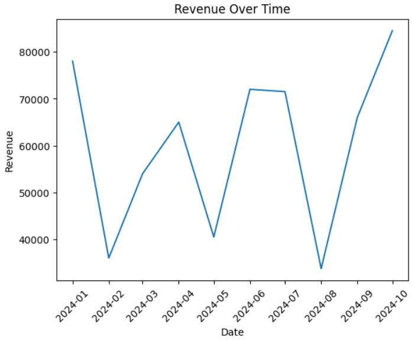

<h1 align="center">⚙️ Python Data Automation</h1>

  Automated CSV Cleaning • Reporting • KPI Generation

---

<!-- Badges -->

  
  
  
  

---

## 📘 Table of Contents
- [Project Overview](#project-overview)
- [Features](#features)
- [Tools & Libraries](#tools--libraries)
- [Repository Structure](#repository-structure)
- [Setup & Running The Script](#setup--running-the-script)
- [Example Output](#example-output)
- [Professional Summary](#professional-summary)

---

# 📌 Project Overview

This project is a **complete Python-based data automation workflow** designed to transform raw CSV data into clean, structured, and insight-ready outputs with a single command.  
It simulates real-world business reporting processes where teams repeatedly download messy spreadsheets and need fast, reliable summaries.

The automation pipeline performs four major functions:

### **1️⃣ Data Ingestion**
- Reads one or multiple raw CSV files from the `/data` directory  
- Automatically detects column types  
- Handles inconsistent formatting, missing values, and string/number mismatches  

### **2️⃣ Data Cleaning & Standardisation**
- Removes duplicate rows  
- Fills or removes missing values depending on variable type  
- Standardises date formats into a consistent `YYYY-MM-DD` structure  
- Ensures numeric fields are correctly typed for calculations  
- Renames columns to a uniform, readable naming convention  

### **3️⃣ Metric Calculation & Aggregation**
Generates a set of business KPIs, such as:
- Total revenue  
- Average revenue per order  
- Total units sold  
- Units sold by product  
- Revenue by region  
- Monthly revenue trends  

All calculations are automated using **Pandas**.

### **4️⃣ Automated Output Generation**
The script exports a complete reporting package into `/output`, including:
- **Cleaned dataset (CSV)**  
- **Summary metrics file (CSV)**  
- **Visual charts (PNG)** — revenue by product, monthly trend, etc.  
- Optional console output for quick review  

These outputs can be dropped directly into dashboards, presentations, or Power BI workflows.

---

### 🔍 Why This Project Matters
This workflow reflects real tasks performed in:
- Business analyst roles  
- Data analyst roles  
- Operations and reporting teams  
- Data automation roles  

It proves your ability to:
- Build data pipelines  
- Automate repetitive reporting  
- Perform robust data cleaning  
- Apply Pandas, Matplotlib, and Python scripting  
- Deliver structured outputs for decision-making  

---

## 🚀 Features
- Reads raw CSV input  
- Handles missing values + outliers  
- Standardises date formats  
- Generates grouped aggregates (e.g., by product, region, category)  
- Exports a cleaned summary CSV  
- Saves visual charts (PNG)  
- Fully automated workflow — ready to schedule via cron or Task Scheduler

---

## 🔧 Tools & Libraries
- **Python 3**
- **Pandas** — data cleaning & transformation  
- **Matplotlib** — chart generation  
- **CSV** — input parsing  

---

## ▶️ Setup & Running the Script

### **1️⃣ Install dependencies and Run the automation**

pip install -r requirements.txt

python automation.py

---

## 📸 Example Output

